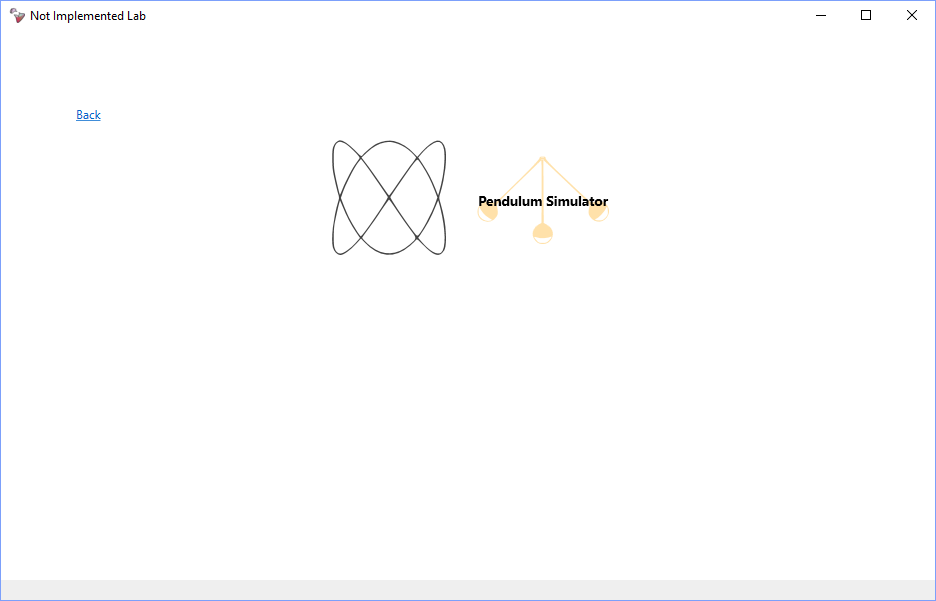
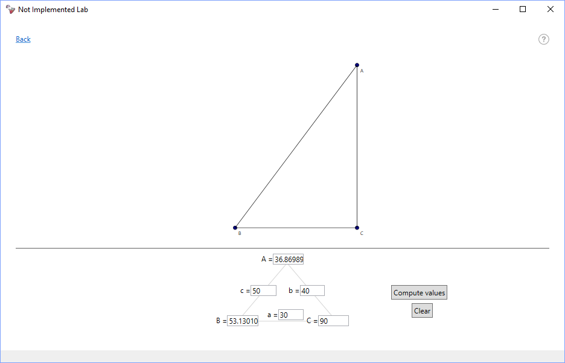

#  NotImplementedLab

NotImplementedLab is an educational purpose, plugin-based virtual lab for simulations & experiments.

The program contains 3 sections (fields):
- Mathematics
- Physics
- Computer Science

Under each field there are the activities (aka "Playground"s), virtual environments specialized on a single task (e.g. conversion, simulator, solving particular problems etc).
The user can interact with them having as much freedom as the playground offers to create experiment with the knowledge and the interface. Some activities offer a help page (the "?" icon in the window top-right corner) explaining some theory or answering possible how-to-use questions.

## Developer

### How to make a plugin

The app comes with no built-in activities. Everything is loaded from DLLs placed in ```Plugins/``` directory. That means you can write an activity yourself to run in NotImplementedLab. Here are the steps I suggest to follow in this regard:

1. First, ```git clone https://github.com/NotImplementedLife/NotImplementedLab```.
2. Open ```NotImplementedLab.sln``` in your Visual Studio (recommend 2017+).
3. Create a new ```WPF Custom Control Library``` project.
4. Delete anything was created automatically, like `Themes/` folder and `CustomControl1.cs`
5. Add `NotImplementedLab` to project References (Right click on References, select "Projects" from the left tab menu and check the box near NotImplementedLab project).
6. Now you have to create 3 elements: two user controls (`Playground.xaml` and `Info.xaml`) and a class (`ShowcaseListItem.cs`).

In the last file, write the following lines:
```C#

namespace Your.Namespace
{
    // This lets NotImplementedLab know about your activity
    public class ShowcaseListItem : NotImplementedLab.Data.ShowcaseListItem
    {
        public ShowcaseListItem() : base(
            "Your Activity Name", 
            "",                    // <-- Display Path data, we'll talk about that later 
            typeof(Playground),    // <-- The User Control type data that will be shown as an Activity
            new Info()             // <-- An instance of the Info page. If you don't want an Info page,
                                   //     just write "null" instead
            ) { }
    }
}

```
 7. At the root of your project create a new file named `ActivityHeader.Metadata.cs` and write the following code:
```C#
using System;
using System.Collections.Generic;

namespace ActivityHeader // <-- Note the namespace name. It is important to be detected by NotImplementedLab
{
    public static class Metadata
    {
        public static string PluginName = "YourPluginName";
        public static List<Tuple<string, string>> Exports = new List<Tuple<string, string>>
        {
            new Tuple<string,string> 
            (
                "Maths",                          // <-- Activity field, must be "Maths", "Physics" or "CS"
                "Your.Namespace.ShowcaseListItem" // <-- Full name of the activity identifier type
            )
        };
    }
}
``` 
 8. Before you build, open the project's `.csproj` file and set the output paths to NotImplementedLab's Plugins directory:
```XML
 <PropertyGroup Condition=" '$(Configuration)|$(Platform)' == 'Debug|AnyCPU' ">
    ...
    <OutputPath>..\NotImplementedLab\bin\Debug\Plugins\</OutputPath>
    <DefineConstants>DEBUG;TRACE</DefineConstants>
    ...
  </PropertyGroup>
  <PropertyGroup Condition=" '$(Configuration)|$(Platform)' == 'Release|AnyCPU' ">
    ...
    <OutputPath>..\NotImplementedLab\bin\Release\Plugins\</OutputPath>
    <DefineConstants>TRACE</DefineConstants>
    ...
  </PropertyGroup>
```

 9. Now you can work on your Playground control. When you want to build, hit `Ctrl+Shift+B` (Build all) and then `F5` (run NotImplementedLab). Under the
field you specified in `ShowcaseListItem.cs`, you should find your activity's icon. Hover it to reveal its name. After the building finishes, you'll find a copy
of "NotImplementedLife.exe" in the `Plugins/` folder. You can safely delete it if you want.

<b>Warning:</b> If you run `Task`s into your `Playground` control, make sure you finish it before the control unloads. Otherwise, the task may keep running and will produce unexpected results/crashes when you want to run a new activity. Check this example:

```C#
public class Playground : UserControl
{
    private bool taskIsRunning = false;

    private void Button_Click() // on a dummy button click
    {
        Task.Run(()=>
        {
            taskIsRunning=true;
            while(taskIsRunning)
            {
                ... // <- do something here
            }
        });
    }

    private void UserControl_Unloaded(object sender, RoutedEventArgs e) // "unloaded" event handler
    {
        taskIsRunning = false; // force the end of the task
    }

}

```

### Display Path Data

Is the graphic content that will be displayed in the field page, basically works like an icon for your activity. It is encoded as follows:

```"<BackgroundColor>!<PathFill1>|<Path1>;<PathFill2>|<Path2>;...;<PathFillN>|<PathN>;"```,

where PathX is a regular Path data. For example, `"Red!Blue|M0,0 L100,100;"` will display a blue line on a red background. If you leave Display Path Data blank (`""`), 
it will be set to the default value, which is ```Turquoise!Yellow|M 100 100 m -75 0 a 75 75 0 1 0 150 0 a 75 75 0 1 0 -150 0;```, which will show up as a yellow circle on a 
turquoise background. Note that the size of the icon is 200x200px.

### If you need WPFMath

If your activity makes use of 3rd party libraries, they'll be copied to `Plugins/` folder automatically. In case of WPFMath, this is a storage waste as it is already present in the directory folder, along with the `.exe`. In order to avoid WPFMath duplication, open the `.csproj` file and add this under `<Reference Include="PresentationFramework" />`:

```XML
    <Reference Include="WpfMath, Version=0.9.0.0, Culture=neutral, processorArchitecture=MSIL">
      <SpecificVersion>False</SpecificVersion>
      <HintPath>..\NotImplementedLab\bin\Debug\WpfMath.dll</HintPath>
      <Private>False</Private>
    </Reference>
```

## Screenshots

</img>
</img>
</img>
</img>
</img>
</img>
</img>
</img>
</img>
</img>
</img>
</img>   


## Requirements

- Windows 10 machine with .NET Framework 4.5.2 installed
- Resolution: 1366 x 768
- RAM: 4GB _(may depend on the type of activity running)_
